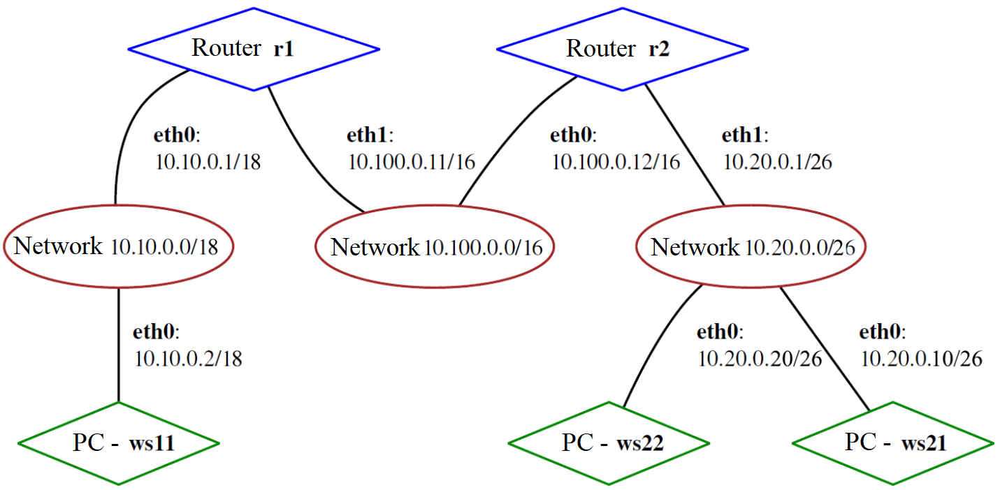

## Part 1. Инструмент **ipcalc**
#### 1.1. Сети и маски
##### 1) Адрес сети *192.167.38.54/13* - 192.160.0.0
##### 2.1) Перевод маски *255.255.255.0*
- Префиксная: /24
- Двоичная: 11111111.11111111.11111111.00000000
##### 2.2) Перевод маски */15*
- Обычная: 255.254.0.0
- Двоичная: 11111111.11111110.00000000.00000000
##### 2.3) Перевод маски *11111111.11111111.11111111.11110000*
- Обычная: 255.255.255.240
- Префиксная: /28
##### 3) Минимальный и максимальный хост в сети *12.167.38.4*
- При маске */8*: 
    - Минимальный хост: 12.0.0.1
    - Максимальный хост: 12.255.255.254
- При маске *11111111.11111111.00000000.00000000*: 
    - Минимальный хост: 12.167.0.1
    - Максимальный хост: 12.167.255.254
- При маске *255.255.254.0*: 
    - Минимальный хост: 12.167.38.1
    - Максимальный хост: 12.167.39.254
- При маске */4*: 
    - Минимальный хост: 0.0.0.1
    - Максимальный хост: 15.255.255.254

#### 1.2. localhost
    Для того, чтобы обратиться к приложению, работающему на localhost, ip адрес устройства должен входить в диапазон 127.0.0.1 — 127.255.255.254
- *194.34.23.100* - нет
- *127.0.0.2* - да
- *127.1.0.1* - да
- *128.0.0.1* - нет
#### 1.3. Диапазоны и сегменты сетей

    Частные диапазоны ip адресов: 10.0.0.0 — 10.255.255.255, 100.64.0.0 — 100.127.255.255, 172.16.0.0 — 172.31.255.255, 192.168.0.0 — 192.168.255.255
##### 1) Определение частных и публичных сетей
- *10.0.0.45* - частная сесть
- *134.43.0.2* - публичная сеть
- *192.168.4.2* - частная сеть
- *172.20.250.4* - частная сеть
- *172.0.2.1* - публичная сеть
- *192.172.0.1* - публичная сеть
- *172.68.0.2* - публичная сеть
- *172.16.255.255* - частная сеть
- *10.10.10.10* - частная сеть
- *192.169.168.1* - публичная сеть
##### 2) Определение IP адресов шлюза у сети *10.10.0.0/18*
    Адреса входящие в диапазон от HostMin до HostMax подходят

- *10.0.0.1*  - не подходит
- *10.10.0.2* - подходит
- *10.10.10.10* - подходит
- *10.10.100.1* - не подходит
- *10.10.1.255* - подходит

## Part 2. Статическая маршрутизация между двумя машинами

- Поднял две виртуальные машины(далее--ws1 и ws2)
- С помощью команды `ip a` посмотрел существующие сетевые интерфейсы:
    - Скрин с вызовом команды `ip a` для ws1:

    - Скрин с вызовом команды `ip a` для ws2:

- Задал следующие адреса и маски:
    - Для ws1 - *192.168.100.10*, маска */16*

    - Для ws2 - *172.24.116.8*, маска */12*

- Выполнил команду `netplan apply` для перезапуска сервиса сети:
    - На ws1

    - На ws2 \


#### 2.1. Добавление статического маршрута вручную
- Добавил статический маршрут от одной машины до другой и обратно при помощи команды вида `ip r add`.
    - Для ws1:

    - Для ws2: \

- Пропинговал соединение между машинами
    - Для ws1: 

    - Для ws2: \


#### 2.2. Добавление статического маршрута с сохранением
- ##### Перезапустил машину с помощью команды `sudo reboot`
- ##### Добавил статический маршрут от одной машины до другой с помощью файла *etc/netplan/00-installer-config.yaml*.
    - На ws1:

    - На ws2:

- Пропинговал соединение между машинами:
    - На ws1:

    - На ws2:


## Part 3. Утилита **iperf3**
#### 3.1. Скорость соединения
- 8 Mbps = 1MB/s (1B = 8b)
- 100 MB/s = 819200 Kbps (1MB = 1024 KB = 1024 * 8 b)
- 1 Gbps = 1024 Mbps (1Gb = 1024Mb)
#### 3.2. Утилита **iperf3**
- ##### Измерили скорость соединения между ws1 и ws2.
    - ws1 выступает в роли серверной части:

    - ws2 выступает в роли клиента:


## Part 4. Сетевой экран
#### 4.1. Утилита **iptables**
- ##### Создал файл */etc/firewall.sh*, имитирующий фаерволл, на ws1 и ws2:
```shell
#!/bin/sh

# Удаление всех правил в таблице «filter» (по-умолчанию).
iptables -F
iptables -X
```
##### Добавил в файл подряд следующие правила:
##### 1) На ws1 примени стратегию, когда в начале пишется запрещающее правило, а в конце пишется разрешающее правило (это касается пунктов 4 и 5).
##### 2) На ws2 примени стратегию, когда в начале пишется разрешающее правило, а в конце пишется запрещающее правило (это касается пунктов 4 и 5).
##### 3) Открой на машинах доступ для порта 22 (ssh) и порта 80 (http).
##### 4) Запрети *echo reply* (машина не должна «пинговаться», т.е. должна быть блокировка на OUTPUT).
##### 5) Разреши *echo reply* (машина должна «пинговаться»).
- Содержание файла */etc/firewall.sh* на ws1:

- Cодержание файла */etc/firewall.sh* на ws2:

- ##### Запустил файлы на обеих машинах командами `chmod +x /etc/firewall.sh` и `/etc/firewall.sh`.
    - Запуск файла */etc/firewall.sh* на ws1:

    - Запуск файла */etc/firewall.sh* на ws2:


> Разница между стратегиями, примененных в первом и втором файлах, заключается в порядке команд: утилита iptables выполняет первое прочитанное правило.

#### 4.2. Утилита **nmap**

- ##### Командой **ping** нашел машину, которая не «пингуется», после чего утилитой **nmap** показал, что хост машины запущен.
- Скрин с вызовом команд **ping** и **nmap**


## Part 5. Статическая маршрутизация сети
Сеть: \

- ##### Поднял пять виртуальных машин (3 рабочие станции (ws11, ws21, ws22) и 2 роутера (r1, r2)).
#### 5.1. Настройка адресов машин
- ##### Настроил конфигурации машин в *etc/netplan/00-installer-config.yaml* согласно сети на рисунке.
- Скрин файла *etc/netplan/00-installer-config.yaml* на ws11:

- Скрин файла *etc/netplan/00-installer-config.yaml* на ws21:

- Скрин файла *etc/netplan/00-installer-config.yaml* на ws22:

- Скрин файла *etc/netplan/00-installer-config.yaml* на r1:

- Скрин файла *etc/netplan/00-installer-config.yaml* на r2:

- ##### Перезапустил сервис сети командой `sudo netplan apply`. 
- ##### Командой `ip -4 a` проверил, что адреса машин заданы верно. 
- Вывод команды `ip -4 a` на ws11:

- Вывод команды `ip -4 a` на ws21:

- Вывод команды `ip -4 a` на ws22:

- Вывод команды `ip -4 a` на r1:

- Вывод команды `ip -4 a` на r2:

- ##### Также пропинговал ws22 с ws21. Аналогично пропинговал r1 с ws11.
- Пинг ws22 с ws21:

- Пинг r1 с ws11:


#### 5.2. Включение переадресации IP-адресов
- ##### Для включения переадресации IP, выполнил команду на роутерах:
`sysctl -w net.ipv4.ip_forward=1`
*При таком подходе переадресация не будет работать после перезагрузки системы.*
- Вывод команды `sysctl -w net.ipv4.ip_forward=1` на r1:

- Вывод команды `sysctl -w net.ipv4.ip_forward=1` на r2:

- ##### Открыл файл */etc/sysctl.conf* и добавил в него следующую строку:
`net.ipv4.ip_forward = 1`
*При использовании этого подхода, IP-переадресация включена на постоянной основе.*
- Скрин с содержанием изменённого файла */etc/sysctl.conf* на r1:

- Скрин с содержанием изменённого файла */etc/sysctl.conf* на r2:


#### 5.3. Установка маршрута по-умолчанию
- ##### Настроил маршрут по-умолчанию (шлюз) для рабочих станций
- Скрин с содержанием файла *etc/netplan/00-installer-config.yaml* на ws11:

- Скрин с содержанием файла *etc/netplan/00-installer-config.yaml* на ws21:

- Скрин с содержанием файла *etc/netplan/00-installer-config.yaml* на ws22:

- Скрин с содержанием файла *etc/netplan/00-installer-config.yaml* на r1:

- Скрин с содержанием файла *etc/netplan/00-installer-config.yaml* на r2:

- ##### Вызвал `ip r`, чтобы показать, что добавился маршрут в таблицу маршрутизации
- Вызов `ip r` на ws11:

- Вызов `ip r` на ws21:

- Вызов `ip r` на ws22:

- Вызов `ip r` на r1:

- Вызов `ip r` на r2:

- ##### Пропинговал с ws11 роутер r2. Чтобы показать, что на r2 пинг доходит использовал команду: `tcpdump -tn -i eth0`
- Пинг роутера r2  с ws11:

- Вызов и вывод команды `tcpdump -tn -i eth0` на r2:


#### 5.4. Добавление статических маршрутов
- ##### Добавил в роутеры r1 и r2 статические маршруты в файле конфигураций. 
- Скрин с содержанием изменённого файла *etc/netplan/00-installer-config.yaml* на r1:

- Скрин с содержанием изменённого файла *etc/netplan/00-installer-config.yaml* на r2:

- Вызов и вывод `ip r` на r1:

- Вызов и вывод `ip r` на r2:

- ##### Запустил команды на ws11: `ip r list 10.10.0.0/[маска сети]` и `ip r list 0.0.0.0/0`
- Вызов и вывод `ip r list 10.10.0.0/18` на ws11:

- Вызов и вывод `ip r list 0.0.0.0/0` на ws11:

> Для адреса 10.10.0.0/18 был выбран маршрут, отличный от 0.0.0.0/0, потому что маршрут по умолчанию (0.0.0.0/0) срабатывает тогда, когда не найден подходящий маршрут в таблице маршрутизации. Для нашей сети был создан маршрут, поэтому используется наш созданный маршрут.

#### 5.5. Построение списка маршрутизаторов

- ##### Запустил на r1 команду дампа: `tcpdump -tnv -i eth0`

- ##### При помощи утилиты **traceroute** построил список маршрутизаторов на пути от ws11 до ws21.

> Для определения промежуточных маршрутизаторов traceroute отправляет серию пакетов данных целевому узлу, при этом каждый раз увеличивая на 1 значение поля TTL («время жизни»). Это поле обычно указывает максимальное количество маршрутизаторов, которое может быть пройдено пакетом. Первый пакет отправляется с TTL, равным 1, и поэтому первый же маршрутизатор возвращает обратно сообщение ICMP, указывающее на невозможность доставки данных. Traceroute фиксирует адрес маршрутизатора, а также время между отправкой пакета и получением ответа (эти сведения выводятся на монитор компьютера). Затем traceroute повторяет отправку пакета, но уже с TTL, равным 2, что позволяет первому маршрутизатору пропустить пакет дальше. Процесс повторяется до тех пор, пока при определённом значении TTL пакет не достигнет целевого узла. При получении ответа от этого узла процесс трассировки считается завершённым.

#### 5.6. Использование протокола **ICMP** при маршрутизации
- ##### Запустил на r1 перехват сетевого трафика, проходящего через enp0s8 с помощью команды: `tcpdump -n -i enp0s8 icmp`

- ##### Пропинговал с ws11 несуществующий IP (например, *10.30.0.111*) с помощью команды:
`ping -c 1 10.30.0.111`


## Part 6. Динамическая настройка IP с помощью **DHCP**

##### Для r2 настроил в файле */etc/dhcp/dhcpd.conf* конфигурацию службы **DHCP**:
- ##### 1) Указал адрес маршрутизатора по-умолчанию, DNS-сервер и адрес внутренней сети. 

- ##### 2) В файле *resolv.conf* пропиcал `nameserver 8.8.8.8`.

- ##### Перезагрузил службу **DHCP** командой `systemctl restart isc-dhcp-server`

- ##### В файле на ws21 закомментировал статические настройки *etc/netplan/00-installer-config.yaml*.

- ##### Машину ws21 перезагрузил при помощи `reboot` и через `ip a` показал, что она получила адрес

- ##### Пропинговал ws22 с ws21 с помощью команды `ping`.

- ##### Указал MAC адрес у ws11, для этого в *etc/netplan/00-installer-config.yaml* добавил строки: `macaddress: 10:10:10:10:10:BA`, `dhcp4: true`


##### r1 настроил аналогично r2, но сделал выдачу адресов с жесткой привязкой к MAC-адресу (ws11)
- ##### Содержание */etc/dhcp/dhcpd.conf*

- ##### Содержание *resolv.conf*

- ##### Перезагрузил службу **DHCP** командой `systemctl restart isc-dhcp-server`

- ##### Скрин с вызовом и выводом команды `ip a` на ws11

- ##### Пропинговал r1 и ws22 с ws11


- ##### Ip адрес ws21 до обновления

- ##### Ip адрес ws21 после обновления

> Для того, чтобы обновить ip адрес использовал сначала команду `sudo dhclient -r` для освобождения текущего ip адреса. Затем, как ip адрес был освобожден, использовал команду `sudo dhclient` для обновления ip адреса.

## Part 7. **NAT**
- ##### В файле */etc/apache2/ports.conf* на ws22 и r1 изменил строку `Listen 80` на `Listen 0.0.0.0:80`, то есть сделал сервер Apache2 общедоступным.
    
    
- ##### Запустил веб-сервер Apache командой `service apache2 start` на ws22 и r1.
    
    

- ##### Добавил в фаервол, созданный по аналогии с фаерволом из Части 4, на r2 следующие правила:
    - ##### 1) Удаление правил в таблице filter - `iptables -F`;
    - ##### 2) Удаление правил в таблице "NAT" - `iptables -F -t nat`;
    - ##### 3) Отбрасывать все маршрутизируемые пакеты - `iptables --policy FORWARD DROP`.
    
- ##### Запустил файл также, как в Части 4.
    
- ##### Проверил соединение между ws22 и r1 командой `ping`. *При запуске файла с этими правилами, ws22 не должна «пинговаться» с r1.*
    
- ##### Добавил в файл ещё одно правило:
    - ##### 4) Разрешить маршрутизацию всех пакетов протокола **ICMP**.
        
- ##### Запустил файл также, как в Части 4.
    
- ##### Проверил соединение между ws22 и r1 командой `ping`. *При запуске файла с этими правилами, ws22 должна «пинговаться» с r1.*
    
- ##### Добавил в файл ещё два правила:
    - ##### 5) Включи **SNAT**, а именно маскирование всех локальных ip из локальной сети, находящейся за r2 (по обозначениям из Части 5 - сеть 10.20.0.0).
    - ##### 6) Включи **DNAT** на 8080 порт машины r2 и добавить к веб-серверу Apache, запущенному на ws22, доступ извне сети.
    
- ##### Запусти файл также, как в Части 4.
- ##### Проверил соединение по TCP для **SNAT**: для этого с ws22 подключился к серверу Apache на r1 командой: `telnet [адрес] [порт]`
    
- ##### Проверил соединение по TCP для **DNAT**: для этого с r1 подключился к серверу Apache на ws22 командой `telnet`
    

## Part 8. Дополнительно. Знакомство с **SSH Tunnels**
- ##### Запустил на r2 фаервол с правилами из Части 7.
- ##### Запустил веб-сервер **Apache** на ws22 только на localhost (то есть в файле */etc/apache2/ports.conf* изменил строку `Listen 80` на `Listen localhost:80`).
    - Содержимое */etc/apache2/ports.conf*:
    
    - Для запуска сервера использовал команду `service apache2 start`:
    
- ##### Воспользовался *Local TCP forwarding* с ws21 до ws22, чтобы получить доступ к веб-серверу на ws22 с ws21. Для этого использовал команду `ssh -L remote_port:local_ip:local_port user@hostname.com`
    
    
- ##### Для проверки, сработало ли подключение выполнил команду `telnet 127.0.0.1 [локальный порт]`
    
- ##### Воспользовался *Remote TCP forwarding* c ws11 до ws22, чтобы получить доступ к веб-серверу на ws22 с ws11. Для этого использовал команду `ssh -R remote_port:local_ip:local_port user@hostname.com`
    
    
- ##### Для проверки, сработало ли подключение выполнил команду `telnet 127.0.0.1 [локальный порт]`
    